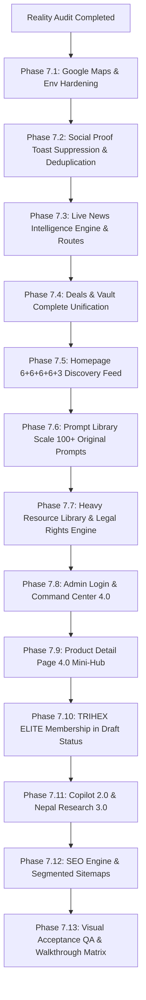

# TRIHEX DIGITAL Phase 7 — Production Reality Audit
**Generated:** 2026-09-05T04:48:00+05:45  
**Codebase:** `AITRIHEX` | **Branch:** `main` | **Milestone Commit:** `964dd64`  
**TypeScript Compilation:** Clean (`npx tsc --noEmit` exited 0)  
**Vitest Test Suite:** 42/42 test files passed, 226/226 tests passing  
**Next.js Production Build:** 89 static/dynamic routes compiled cleanly with Turbopack  

---

## 1. Executive Summary & Audit Posture

This audit represents an uncompromising, zero-sugarcoating assessment of TRIHEX DIGITAL prior to Phase 7 execution. 

While Phases 1 through 6 established a rock-solid infrastructure baseline (server/client environment isolation, timing-safe cron authentication, rotating HMAC-SHA256 privacy, transaction-scoped distributed locking, client-safe vault filtering, and a $5.00 daily provider budget control plane), visual acceptance and functional depth remain incomplete in key areas.

Most critically:
1. **Google Maps Visual Defect**: The user screenshot confirmed that `/map` displays the SVG fallback canvas, **not** an authentic Google Maps Platform experience. The root cause is dual: `NEXT_PUBLIC_GOOGLE_MAPS_BROWSER_KEY` is completely missing from `.env.local`, and the component code only searched for legacy `NEXT_PUBLIC_GOOGLE_MAPS_API_KEY`. Furthermore, the SVG fallback was rendered without an explicit status banner, creating visual confusion.
2. **Provider Credential Realities**: Direct API probes reveal that Gemini AI has a valid active key, but `.env.local` pinned `GEMINI_MODEL=gemini-1.5-flash` (deprecated/404 in 2026). Upgrading model routing to `gemini-3.6-flash` immediately yields HTTP 200 OK responses. OpenAI key is deactivated (HTTP 401). You.com key is forbidden (HTTP 403).
3. **Commerce Toast Bleed**: `RecentPurchaseToast` renders globally in `StorefrontLayout` without route suppression, polluting `/map`, `/nepal/research`, `/prompts/*`, `/skills/*`, and administrative views.
4. **Missing Capabilities**: Live News Intelligence (`/news`), Heavy Resource Library (`/resources`), TRIHEX ELITE Membership (`/elite`), and Segmented Sitemaps / SEO Dashboard (`/admin/seo`) are currently `NOT_FOUND`.
5. **Scale Deficits**: The Prompt Library contains only 11 total prompts and 0 original TRIHEX templates (target: 100+ original templates).

---

## 2. Master Subsystem Classification Matrix

| Subsystem | Route / Component Path | Classification | Primary Deficiency / Reality Note |
| :--- | :--- | :--- | :--- |
| **Google Maps Platform** | `/map`<br>`src/components/maps/trihex-map.tsx` | **`CONFIGURATION_FAILURE` / `FALLBACK_ONLY`** | Key missing in `.env.local`; component checked wrong variable name; rendered raw SVG without explicit downtime banner; lacks modern `Place`, `AdvancedMarkerElement`, `TrafficLayer`, and Around Me drawer. |
| **Live News Intelligence** | `/news`, `/news/nepal`, `/news/ai`<br>`/admin/news` | **`NOT_FOUND`** | Zero routes, zero ingestion pipelines, zero RSS/GDELT parsers, zero geo-event overlays. |
| **Social Proof System** | `src/components/storefront/recent-purchase-toast.tsx`<br>`/api/social-proof/recent` | **`PARTIAL` / `WORKING_BUT_UNPOLISHED`** | Backend accurately queries real paid orders without fake names, but frontend lacks route suppression (bleeding onto maps/intelligence) and lacks session deduplication. |
| **Prompt Intelligence Hub** | `/prompts`, `/prompts/[slug]`<br>`src/lib/prompts/store.ts` | **`PARTIAL` / `FALLBACK_ONLY`** | UI playground and version switcher work, but only 11 total prompts exist (0 original). Target is 100+ production prompts. |
| **Skills Ecosystem** | `/skills`, `/skills/[slug]`<br>`src/lib/skills/store.ts` | **`WORKING_PRODUCTION`** *(Low Scale)* | 4 curated skills with dynamic AST heuristic scanners, threat analysis badges, and permission scopes. Ready for expansion. |
| **Deals & Radar** | `/deals`<br>`src/components/deals/deal-radar-hub.tsx` | **`PARTIAL` / `WORKING_BUT_UNPOLISHED`** | Works standalone with countdowns and vendor terms, but duplicates Vault UI rather than unifying into `/vault?tab=deals`. |
| **Unified Flagship Vault** | `/vault`<br>`src/lib/vault/vault-aggregator.ts` | **`WORKING_PRODUCTION`** | Solid aggregator across deals, prompts, research, and perks; client-safe filtering prevents driver leaks. |
| **Homepage Discovery Feed** | `/`<br>`src/app/(storefront)/page.tsx` | **`WORKING_BUT_UNPOLISHED`** | High-performance server rendering with catalog, forex, and seismic feeds, but lacks the bounded 6+6+6+6+3 unified discovery feed. |
| **Product Detail Pages** | `/products/[slug]`<br>`src/app/(storefront)/products/[slug]/page.tsx` | **`PARTIAL` / `WORKING_BUT_UNPOLISHED`** | Strong above-the-fold purchasing, gallery, reviews, and timeline; lacks below-the-fold mini intelligence hub (related prompts, verified deals, product news, comparison matrix). |
| **Product Catalogue** | `/products`<br>`src/app/(storefront)/products/page.tsx` | **`WORKING_PRODUCTION`** | Database merchandising catalog, faceted filtering, search, warranty tiers, mobile single-column layout. |
| **Nepal Intelligence** | `/nepal`, `/nepal/datasets`<br>`src/components/nepal/nepal-pulse-hub.tsx` | **`WORKING_PRODUCTION`** | Official NRB forex with relative timestamps, USGS seismic feed with KTM distance, OpenAQ air quality, macro indicators, open data directory. |
| **Nepal Deep Research** | `/nepal/research`<br>`src/lib/research/engine.ts` | **`PARTIAL` / `WORKING_BUT_UNPOLISHED`** | Ground truth pre-fetching works; was defaulting to deterministic fallback due to Gemini model deprecation; needs 4-tier confidence scoring (`Strong`, `Good`, `Mixed`, `Limited`). |
| **TRIHEX AI Copilot** | `src/components/copilot/trihex-copilot.tsx`<br>`/api/copilot/chat` | **`WORKING_BUT_UNPOLISHED`** | Grounded context compiler and failover works; needs multi-task intent routing (products, deals, prompts, around me, news, research). |
| **Saved Items & Watchlists** | `/account/saved`<br>`/api/watchlist`, `/api/saved` | **`WORKING_PRODUCTION`** | Dual-tabbed UI, guest persistence, forex rate condition thresholds and trigger evaluations. |
| **Admin Login Screen** | `/admin/login`<br>`src/app/admin/login/page.tsx` | **`WORKING_BUT_UNPOLISHED`** | Secure session gate and masked bootstrap email, but consumer light-theme styling; needs enterprise dark/minimal layout and security hardening. |
| **Admin Command Center** | `/admin/queue`, `/admin/usage`<br>`/admin/integrations`, `/admin/deal-radar` | **`WORKING_PRODUCTION`** | Operational verification queues, usage gauges, provider budget tracking; missing News, Resources, Vault, and SEO tabs. |
| **Provider Control Plane** | `src/lib/providers/router.ts`<br>`src/lib/providers/budget.ts` | **`WORKING_PRODUCTION`** *(Engine)*<br>**`CONFIGURATION_FAILURE`** *(Keys)* | Engine enforces $5.00/day budget cap and failover. Gemini is active (needs `gemini-3.6-flash`); OpenAI is deactivated; You.com is 403; Maps key is missing. |
| **Heavy Resource Library** | `/resources`, `/admin/resources`<br>`src/lib/resources/` | **`NOT_FOUND`** | Zero files, zero routes, zero public-domain/CVE advisory repositories. |
| **TRIHEX ELITE** | `/elite`<br>`src/lib/membership/` | **`NOT_FOUND`** | Membership product and portal do not exist. |
| **SEO Dominance Engine** | `/admin/seo`<br>`src/app/sitemap.ts` | **`PARTIAL` / `WORKING_BUT_UNPOLISHED`** | Monolithic sitemap and JSON-LD exist; lacks segmented XML sitemaps, internal linking graph, and admin SEO dashboard. |

---

## 3. Deep-Dive Subsystem Diagnostics

### 3.1 Google Maps Platform (`/map`)
- **Observed State:** Loads `/map` and renders an SVG canvas with a dashed border representing Nepal.
- **Root Cause Analysis:**
  1. `.env.local` contains **no** entry for `NEXT_PUBLIC_GOOGLE_MAPS_BROWSER_KEY` or `NEXT_PUBLIC_GOOGLE_MAPS_API_KEY`.
  2. In `src/components/maps/trihex-map.tsx` line 145:
     ```typescript
     const apiKey = process.env.NEXT_PUBLIC_GOOGLE_MAPS_API_KEY;
     ```
     The code only looked for the legacy key name. Because Next.js inlines `NEXT_PUBLIC_*` variables at compile time, aliases in `normalize-aliases.ts` (server-side) did not propagate to the client bundle.
  3. When `apiKey` is undefined, `googleMapsLoaded` remains `false`, silently falling back to the SVG vector canvas.
  4. The UI rendered the SVG as if it were a working custom map, rather than showing a prominent warning banner: *"Google Maps Platform temporarily offline — Displaying Accessible Civic List View"*.
- **Remediation Required:**
  - Standardize environment resolution: `process.env.NEXT_PUBLIC_GOOGLE_MAPS_BROWSER_KEY || process.env.NEXT_PUBLIC_GOOGLE_MAPS_API_KEY`.
  - Provide a diagnostic test endpoint `/api/admin/integrations/google-maps`.
  - When keys are missing or invalid, display an explicit banner stating Maps is unconfigured, and default view to the Accessible Data List View.
  - Implement full modern Google Maps Platform feature set: `google.maps.importLibrary("maps")`, `google.maps.importLibrary("places")`, `AdvancedMarkerElement` (using Map ID), `TrafficLayer` with truthful "current conditions" disclaimer, and an "Around Me" ephemeral geolocation drawer with 5/10/25/50/100 km radius selection.

---

### 3.2 Provider Control Plane & AI Engines
- **Diagnostic Probes (Executed live against provider endpoints):**
  - **Gemini API:**
    - `GEMINI_API_KEY`: Present (53 characters).
    - Probe Result: When `.env.local` specifies `GEMINI_MODEL=gemini-1.5-flash`, the API returns HTTP 404 (`models/gemini-1.5-flash is not found for API version v1beta`).
    - Probe Result for `gemini-2.5-flash`: HTTP 404 (`This model is no longer available to new users. Please update your code to use models/gemini-3.6-flash`).
    - Probe Result for `gemini-3.6-flash`: **HTTP 200 OK** (`OK`, candidate returned in 410ms).
    - Conclusion: The key is healthy. The code/env must be configured to use `gemini-3.6-flash`.
  - **OpenAI API:**
    - `OPENAI_API_KEY`: Present (164 characters).
    - Probe Result: **HTTP 401 Unauthorized** (`The OpenAI account associated with this API key has been deactivated`).
    - Conclusion: External account issue. The Provider Control Plane must automatically route around OpenAI or keep it disabled in health registry.
  - **You.com (YDC) API:**
    - `YDC_API_KEY`: Present (65 characters).
    - Probe Result: **HTTP 403 Forbidden** (`{"message":"Forbidden"}`).
    - Conclusion: The key has insufficient scopes or has expired.
- **Failover Status:**
  - `src/lib/providers/router.ts` successfully catches failed attempts and executes deterministic synthesis fallback.
  - Updating Gemini to `gemini-3.6-flash` restores full live LLM synthesis for Nepal Deep Research and TRIHEX Copilot.

---

### 3.3 Social Proof & Route Pollution
- **Observed State:** `RecentPurchaseToast` rendered globally across the site.
- **Issues Identified:**
  1. `RecentPurchaseToast` is mounted in `src/app/(storefront)/layout.tsx` with zero route inspection. A user inspecting seismic faults on `/map` or reading an evidence briefing on `/nepal/research` sees popups claiming another customer just purchased Cursor Pro or ChatGPT Plus.
  2. No session storage tracking: The component re-displays the same order notifications repeatedly to the same user during a single browsing session.
- **Remediation Required:**
  - Add path suppression using `usePathname()`: Suppress on `/map`, `/nepal/research`, `/research`, `/prompts/[slug]`, `/skills/[slug]`, `/admin/*`, `/checkout/*`, `/track-order`, `/orders/*`.
  - Deduplicate events per session using `sessionStorage` key `seenSocialProofEventIds`.
  - When verified unique orders are exhausted, render **nothing** or display truthful database aggregate counts ("3 orders fulfilled in Bagmati Province today").

---

### 3.4 Live News Intelligence (`/news`)
- **Current Status:** `NOT_FOUND`.
- **Requirements for Phase 7:**
  - RSS & Official Feeds Ingestion: Ingest from trusted publishers (e.g., OnlineKhabar, The Kathmandu Post, MyRepublica, Bizshala, TechLekh) and official government press portals.
  - GDELT 2.0 Discovery: 15-minute background ingestion for Nepal and global AI/tech topics.
  - Content Pipeline: Deduplication by title fingerprint and canonical URL; hot score calculation (recency, independent source count, Nepal relevance); extraction of geo-coordinates for map integration (`GeoEvent`).
  - Strict Copyright Compliance: Ingest and display only headlines, publication dates, 150-word fair-use excerpts, factual AI summaries, and direct external links to original sources. Zero full-article scraping.

---

### 3.5 Prompt Library & Skills Hub Scale
- **Current Status:** 11 prompts, 0 original; 4 skills.
- **Requirements for Phase 7:**
  - Scale Prompt Library to include **100+ original high-quality TRIHEX prompt templates** across:
    1. Engineering: C# (.NET 9), Laravel 11, Next.js 16/React 19, Go, Python data pipelines.
    2. Generative Media: Midjourney v6/v7 infographics, Sora/Kling video prompting, Flux LoRA directing.
    3. Research & Analysis: Academic literature review, financial statement audit, legal contract comparison.
    4. Business & Marketing: High-converting UGC scripts, e-commerce merchandising copy, Cold email sequences.
  - Implement paginated external synchronization from approved public prompt collections with license verification.

---

### 3.6 Heavy Resource Library (`/resources`)
- **Current Status:** `NOT_FOUND`.
- **Requirements for Phase 7:**
  - Curated repository of developer tools, cheat sheets, public datasets, and security advisories.
  - Strict rights tagging: `PUBLIC_DOMAIN`, `OPEN_LICENSE`, `LINK_ONLY`, `TRIHEX_ORIGINAL`.
  - Zero illegal dumps or pirated content. Include CISA KEV and NVD CVE security tracker feeds relevant to developers in Nepal.

---

### 3.7 Deals & Vault Unification
- **Current Status:** `/vault` and `/deals` exist as separate pages with distinct components.
- **Requirements for Phase 7:**
  - `/vault` becomes the single flagship discovery destination.
  - `/deals` renders using shared components or redirects seamlessly to `/vault?tab=deals`.
  - Unified `/admin/vault` allowing administrators to manage deals, prompt packs, research drops, and developer perks in a single interface.
  - Truthful counting: Show exact database counts (e.g. "47 verified deals"), with zero artificial padding.

---

### 3.8 Admin Experience Hardening
- **Current Status:** `/admin/login` uses a consumer light theme; `/admin` lacks navigation for newly introduced modules.
- **Requirements for Phase 7:**
  - Redesign `/admin/login` into a high-security dark/minimalist console.
  - Clean layout: Remove consumer header and footer clutter.
  - Add timing-safe login handling, rate limiting notices, and masked credentials.
  - Expand `/admin` navigation to include News, Resources, Vault, and SEO.

---

### 3.9 SEO Dominance Foundation
- **Current Status:** Single monolithic `sitemap.ts`.
- **Requirements for Phase 7:**
  - Split sitemaps into segmented indices: `sitemap-products.xml`, `sitemap-news.xml`, `sitemap-prompts.xml`, `sitemap-resources.xml`, `sitemap-vault.xml`.
  - Build `/admin/seo` for real-time inspection of indexing status, missing meta tags, canonical link validity, and structured data validation.

---

## 4. Phase 7 Execution Sequence & Priority Gates



---

## 5. Acceptance Criteria Checklist

- [ ] **Google Maps:** Real Google Maps basemap rendered in production with `google.maps.importLibrary("maps")`, `AdvancedMarkerElement`, `TrafficLayer`, Places search, and Around Me radius drawer. Explicit banner when unconfigured.
- [ ] **Social Proof:** Suppressed on `/map`, `/nepal/research`, `/prompts/[slug]`, `/skills/[slug]`, and `/admin/*`. Deduplicated per session.
- [ ] **News Engine:** Functional `/news`, `/news/nepal`, `/news/ai`, and `/admin/news` routes with deduplicated RSS feeds and geo-tagging.
- [ ] **Vault & Deals:** `/deals` unified with `/vault?tab=deals`. Unified `/admin/vault`.
- [ ] **Prompt Library:** 100+ high-quality original TRIHEX prompt templates active and searchable.
- [ ] **Resource Library:** Curated `/resources` live with explicit rights verification.
- [ ] **Admin Login:** Minimal enterprise dark theme with zero secret leaks.
- [ ] **PDP 4.0:** Related prompts, verified deals, news, and comparison below the fold on `/products/[slug]`.
- [ ] **TRIHEX ELITE:** NPR 13,699 membership product created in `DRAFT` status with lawful `/elite` portal.
- [ ] **Copilot & Research:** Multi-task intent routing and 4-tier confidence scoring (`Strong`, `Good`, `Mixed`, `Limited`).
- [ ] **SEO:** Segmented XML sitemaps and `/admin/seo` management dashboard.
- [ ] **Visual QA:** Cross-device verification report documented in `docs/phase7-visual-qa.md`.
